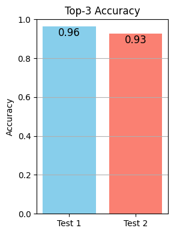

# Fairer AI for Skin Cancer Detection: A Deep Learning Approach

**Welcome!** This portfolio project was built during a three-week sprint in my data science bootcamp — from exploration to prototyping, training, and deployment. The goal: develop a lightweight, privacy-respecting AI model that can identify malignant skin lesions **across all skin tones**.

## How to explore

- [View the GitHub Repository](https://github.com/mattskraft/all-skin-deep)
- [Try the Web Demo](https://effervescent-tartufo-d88474.netlify.app/)

## Highlights

- Applying **Neural Style Transfer (NST)** to create realistic images of skin lesions on dark skin
- Fine-tuning a **MobileNetV2** model for accurate and efficient classification
- Deploying the model in-browser using **TensorFlow.js** for full client-side inference, preserving patient privacy
- Evaluation metrics include F1 score, confusion matrix, and Top-3 accuracy  
- Fully reproducible notebooks available

---
## The Story Behind

### Why This Matters

Skin cancer can be life-threatening—but early detection saves lives. Dermatoscopy aids diagnosis, and AI tools can support clinical decision-making.

However, many AI models in dermatology are trained on datasets overwhelmingly dominated by **light skin tones**, leading to underperformance—and potential misdiagnosis—for people with **darker skin**. The problem isn’t just technical—it’s a serious issue of **health equity**.

### A Glitch in the Data

As a data scientist, the solution seems obvious:

> Include dermoscopic images of skin lesions on **dark skin** in the training data! Duh.

Unfortunately, this is easier said than done. Let's have a look at [ISIC](https://www.isic-archive.com/), the largest collection of dermatology images in the web with over half a million publicly available images. The first challenge is that only about 2% of the images (about 10.000) have a skin tone annotation. That already makes it difficult to create a dataset balanced across all skin tones. But even within the annotated subset, deeper problems emerge:

    

First, images of lighter skin tones are more common. More importantly, of the 1,566 images labeled as Fitzpatrick Skin Types V and VI (the darkest tones), only 5 (!) have a malignant diagnosis. While it's true that skin cancer incidence is lower in darker skin, these numbers are unlikely to reflect real-world distributions.

In short:
> Skin lesion images on dark skin are virtually unvailable for training.

This gap needs to be bridged. With that in mind, I defined three **project objectives**:

### Objective 1:

<h4 style="text-align: center; margin-top: -0.5em;">
Train a skin lesion classifier that performs equally well on light and dark skin images
</h4>

I explore how **synthetic data generation** can help overcome the unavailable data problem. For this, I used Neural Style Transfer (NST) to create synthetic yet realistic images of skin lesions on dark skin.

### Objective 2:

<h4 style="text-align: center; margin-top: -0.5em;">
Use a lightweight model to ensure data privacy and efficient classification
</h4>

Defining this early in the project helped guide model selection. To ensure data privacy, one option is to run the model entirely in the browser, so that no data ever leaves the user's device. This requires a model with a lightweight architecture that can run inference quickly. Among the commonly used models, MobileNetV2 stood out for being small, fast, and browser-compatible.

<figure style="text-align: center; font-style: italic;">
  
  <figcaption></figcaption>
</figure>

### Objective 3:

<h4 style="text-align: center; margin-top: -0.5em;">
Achieve a high top-3 accuracy for reliable clinical triage
</h4>

In clinical settings, knowing the model’s top 3 predictions can be just as helpful as a single-label output. It allows clinicians to identify high-priority cases quickly and streamline their workflow — a process known as triaging.

Consider a clinician examining three skin lesion cases, with the classifier returning the following top-3 predictions:

  

    
Case 1

    
  

  

    
Case 2

    
  

  

    
Case 3

    
  

These results could help the clinician rule out Case 1 (clear benign), and prioritize Case 2 (strong melanoma prediction) over Case 3 (less confident but still concerning). A high top-3 accuracy is therefore sufficient for many clinical use cases — and was a key target in this project.

## Dataset
For this project, I used the **HAM10000** dataset that is described in detail [here](https://www.nature.com/articles/sdata2018161) and can be downloaded from [Kaggle](https://www.kaggle.com/datasets/kmader/skin-cancer-mnist-ham10000). It consists of 10015 dermatoscopic images covering 7 different diagnoses. As this plot shows

<figure style="text-align: center; font-style: italic;">
  
  <figcaption>Class distribution in the HAM10000 dataset. Benign diagnoses are color-coded in green, non-dangerous but cancerous diagnoses in yellow, and the critical melanoma class in red. </figcaption>
</figure>

the dataset is highly unbalanced: benign nevi appear about 6 times more often than melanoma, and over 60 times more often than the smallest class. Such extreme class imbalance can have serious consequences when training a deep neural network, and requires careful mitigation — which I’ll discuss later.

Another important caveat is that the dataset includes **multiple images of the same lesion**:

  
  
  <figcaption>Left: number of images per lesion. About half of lesions have more than one image. Right: An example of a lesion with three images taken under different conditions.</figcaption>

These duplicates typically show the same lesion at different magnifications or angles. To avoid **data leakage** between training and validation, I removed all duplicate entries and retained only one image per lesion.

Removing duplicates yields the final dataset that will be used in this project:

<pre>
Final count of images to be used: 7470
Final distribution of images across classes:
dx
nv       5403
bkl       727
mel       614
bcc       327
akiec     228
vasc       98
df         73
</pre>

## Neural Style Transfer

For this project, I followed the approach of  Neural Style Transfer (NST) as outlined in the original paper ["A Neural Algorithm of Artistic Style"](https://arxiv.org/abs/1508.06576) by Gatys et al. (2015). My implementation is based on a [PyTorch tutorial](https://pytorch.org/tutorials/advanced/neural_style_tutorial.html), with several custom adaptations for dataset integration.

In a nutshell, NST blends the content of one image with the style of another by optimizing a new image to match high-level structure from the content image and low-level texture patterns from the style image, using a pre-trained VGG-19 convolutional neural network.

<figure style="text-align: center; font-style: italic;">
  
  <figcaption> Figure: VGG-19 architecture used for neural style transfer. Content features are collected from <code>conv4_2</code>, while style features are collected from <code>conv1_1</code> to <code>conv5_1</code>. </figcaption>
</figure>

### Process overview

- An **output image** is initialized (usually with the content image, or noise).
- Both the **content image** and the **style image** are passed through VGG-19, extracting feature maps at specified layers:

    - **Content features** are extracted from deeper convolutional layers, which preserve the spatial structure and high-level features of the image. Think "*what* is in the image?" (object shapes, locations, and high-level semantics).

    - **Style features** are extracted from multiple shallower layers, which capture low-level patterns. Think "*how* does it look?" (color structures, textures, fine details).

- The output image is iteratively updated to minimize a combined loss:

    - Content loss: difference between content features of output and content image
    - Style loss: difference between style features (computed via Gram matrices) of the style image and output image 
    - Total variation loss: encourages spatial smoothness in the output image

- The VGG-19 network itself is not trained (its weights are frozen), only the pixels of the generated image are optimized using backpropagation.

### Generating Synthetic Skin Lesion Images

Given the lack of training images showing skin lesions on dark skin, I used NST to generate synthetic examples by blending light-skin lesion images with the texture of dark skin. The approach was:
- Use a dermoscopic image of a lesion on light skin as the **content image**
- Use a patch of dark skin (without lesions) as the **style image**
- Generate a synthetic image that preserves the lesion but adopts the color and texture of dark skin

To do this, I assembled the two cumstom datasets:

- **Content images**: a selected subset of the 7470 lesion images (more on that further down)
- **Style images**: a manually curated set of 75 ISIC images
    - all labeled as Fitzpatrick Skin Type V or VI
    - contained no visible lesions

The figure below shows four examples of content/style/generated image triplets. Overall, NST appeared to work as intended: the synthetic images reflect the texture and tone of the style image while retaining the shape and detail of the lesion from the content image. Whether the features most relevant for classification (e.g., lesion borders, color structures) are preserved remains an open question — and can only be assessed through model performance.

<figure style="text-align: center; font-style: italic;">
  
  <figcaption> Figure: Four examples of style-transferred skin lesion images, blending lesion content with dark-skin textures.</figcaption>
</figure>

As a preliminary sanity check, I calculated the Structural Similarity Index Measure (SSIM) between each original content image and its style-transferred counterpart. SSIM measures similarity based on luminance, contrast, and structure, where 1 means perfect similarity and 0 means no similarity. The histogram below shows that while most generated images maintain decent similarity, a few are clear outliers. Manual inspection confirmed that something had gone wrong in those cases. For this project, I excluded all images with an SSIM score below 0.3.

  
  
  <figcaption>Left: Distribution of SSIM scores. Right: Four pairs of original (top) and generated (bottom) images for the two lowest (left) and the two highest (right) SSIM scores. </figcaption>

## Training Pipeline

Developing a working training pipeline involved quite a bit of prototyping and parameter tweaking. Let’s start with a bird’s-eye view before going into the details. Looking at the training pipeline outlined in the figure, the most notable feature is that training occurs in two stages. Here's the rationale:

- Neural Style Transfer is computationally expensive. Generating a single 512 × 512 image takes about one minute on a GPU, so performing style transfer on every image in the HAM10000 dataset would have taken over 100 hours—well beyond the scope of my 3-week project. I therefore opted for a data-driven compromise: generate the same number of NST images per class.

- In **Stage 1**, the model is trained using all images in their original form, i.e., without style transfer. This yields a "baseline" model that learns to classify the seven lesion types in the dataset—though only on light skin images.

- In **Stage 2**, the model is further fine-tuned on a smaller dataset combining both **original** and **style-transferred** images. Why mix both types? Recall that one of the main objectives of this project was for the model to perform equally well on light and dark skin:
    - The **style-transfered** images help the model become more robust when classifying lesions on dark skin.
    - The **original** images help prevent the model from "forgetting" what it learned in stage 1—that is, losing performance on light skin.

- After each stage, the model was evaluated on the test set (referred to as Test 1 and Test 2 in the figure). Test 1 assesses how well the model performs on light skin (a baseline), while Test 2 checks whether fine-tuning on style-transferred images has negatively impacted overall performance.

<figure style="text-align: center; font-style: italic;">
  
  <figcaption> </figcaption>
</figure>

<strong>Click to expand step-by-step breakdown of the training pipeline</strong>

Let us now go through it step by step, explaining important parameter choices on the way.

- From the total dataset, a test set (15%) was split off that would be used later on to evaluate the model after both training stages.

- The remaining images were used for the two training stages:
    - For stage 1, all images were further split into a train (70%) and validation set (15%).
    - For stage 2, a class-balanced dataset was created by selecting all images from the smalles class and randomly selecting the same number of images from the larger classes. This dataset was used to generate synthetic images with NST.

- The stage 1 training essentially consisted in a fine-tuning of a pre-trained MobileNetV2 model.
    - All but the last block (about 8 layers) of the base model where frozen, and a classification head with (7 output neurons, softmax) was put on top.
    - Two measures were taken to mitigate the heavy class-imbalance of the data:
        - A weighted data generator was implemented that oversampled underrepresented classes during batch selection.
        - A weighted focal loss was implemented that uses class weights to handle class imbalance.

- The dataset for stage 2 training was created as follows:
    - Neural style transfer was used to generate synthetic images. For this, each image in the class-balanced dataset was chosen as content image and randomly paired with an image from the manually selected style images.
    - Half of the synthetic images were randomly selected and combined with the natural version of the other half, and vice versa, creating two datasets that each consist of both natural and NST generated images.

- The stage 2 training then was a cross-style training that consisted in two rounds. During round 1, the model was trained on one half of the above dataset and evaluated on the other, while during round 2 it was the other way around.

- The training history plots show a steady decrease in loss and an increase in F1 score over time in both stages. While stage 1 training follows a typical fine-tuning curve, stage 2 shows some fluctuation due to the mixed natural and style-transferred data. Overall, the model converges well in both cases without signs of overfitting.

<figure style="text-align: center; font-style: italic;">
  
  <figcaption>Figure: Training history of stage 1 (left) and of the two round1 of stage 2 (right). Shown is the training and validation loss (top) and the training and validation metric (F1-score macro) (bottom).</figcaption>
</figure>

## Model Evaluation

Evaluating a medical diagnosis model requires more than just accuracy. It’s about understanding **what the model gets wrong**, and whether its mistakes are clinically acceptable.

To assess performance after each training stage, I ran inference on a **held-out test set** and compared results using standard classification metrics, including **confusion matrices**, **F1 scores**, and **top-3 accuracy**.

### Confusion matrices (How well does the model distinguish diagnoses?)

- After **stage 1**, performance varied widely between classes. Notably, **melanoma** — the most critical class — had the **highest recall** (~90%), meaning it was correctly identified most of the time.
However, it also had a high **false positive rate**: many non-melanoma lesions were mistakenly flagged as melanoma (e.g., nearly half of all bkl lesions).
- After **stage 2** (which included style-transferred images), the model's predictions shifted:
    - **Recall improved** for some underrepresented classes (df, vasc)
    - **False positives for melanoma decreased**, meaning fewer benign cases were incorrectly flagged
    - Slight **drop in melanoma recall**, a trade-off worth examining closely

  
  
  <figcaption>Figure: Confusion matrices on the test set after stage 1 (left) and after stage 2 (right). Each row shows how often a true class is predicted as each class. Rows sum to 1.</figcaption>

### F1 Scores and Top-3 Accuracy

- The **F1 score** (harmonic mean of precision and recall) gives a more balanced view.
Results are mixed: some classes benefit from stage 2 fine-tuning, while others (like mel) show a small drop.

- Importantly, **top-3 accuracy remains high** in both stages — a critical objective for this project.
In clinical triage, knowing whether the correct label is among the model’s top 3 predictions is often more useful than a single-label decision.

  
  
  <figcaption>Left: F1 scores by class (macro average highlighted). Right: Top-3 accuracy comparison between the two tests.</figcaption>

### Takeaway

Fine-tuning with synthetic dark-skin images did **not degrade overall model performance**, and even helped reduce false positives for melanoma. This suggests that **style-transferred data augmentation can improve fairness** without sacrificing clinical utility — a promising step toward inclusive AI in dermatology.

## Limitations & Future Directions

- **Ultimate test missing**: While this project aimed to improve classification across skin tones, it's still unclear whether the model truly performs better on real dark-skin images. Currently, there is no publicly available dataset with both lesion labels and verified dark-skin tones to test this.

- **Melanoma precision is low**: Although recall for melanoma is high, precision remains low — meaning many benign cases are misclassified as melanoma. This limits clinical applicability and points to the need for improving the baseline model.
  
- **Style transfer quality varies**: The quality of the generated NST images is inconsistent. Some artifacts may distort lesion structure, which could impact model learning. Fine-tuning the NST parameters or adopting alternative generation methods (e.g., GANs) may yield better results.

---

## Acknowledgments

This project was inspired and guided by the following works:

- [Improving Skin Color Diversity in Cancer Detection: Deep Learning Approach](https://pmc.ncbi.nlm.nih.gov/articles/PMC10334920/)  
  Inspiration for applying Neural Style Transfer for data augmentation

- [Neural Transfer Using PyTorch](https://pytorch.org/tutorials/advanced/neural_style_tutorial.html)  
  Very nice tutorial on the implementation of NST using PyTorch

- [Skin Lesion Analyzer + TensorFlow.js Web App](https://www.kaggle.com/code/vbookshelf/skin-lesion-analyzer-tensorflow-js-web-app)  
  Motivation for using a lightweight CNN architecture

---

## License

MIT License.
